# <p align="center">Fourth Year Final Project</p>

<p align="center"></p>

## [Contents](#contents)
* [Project Details](#details)
* [Introduction](#intro)
* [Video Demo](#demo)
* [Dissertation](#dissertation)
* [Project Wiki](#wiki)
* [Architecture](#arc) 
* [Features](#features)
* [App Preview](#preview)
* [Deployment](#deploy)


# Project Details<a name = "details"></a>

| Project Details   |     |
| --- | --- |
| **Course** | BSc (Hons) in Software Development  |
| **Module** |  Applied Project and Minor Dissertation |
| **College** | [GMIT](http://www.gmit.ie/) Galway |
| **Students** | [Patrick Moran](https://www.linkedin.com/in/patrick-moran-7a349014b/)&nbsp;&nbsp;&nbsp;&nbsp;&nbsp;&nbsp;&nbsp;&nbsp;&nbsp; G00179039<br/>[Gereard Naughton](https://www.linkedin.com/in/gerard-naughton-732193150/)&nbsp; G00209309<br/>[Andrei Petruk](https://www.linkedin.com/in/andrei-petruk-33b135ab/)&nbsp;&nbsp;&nbsp;&nbsp;&nbsp;&nbsp;&nbsp;&nbsp;&nbsp;&nbsp;G00328108 |
| **Project Supervisor** | Daniel Cregg |
| **Module Supervisor** | John Healy |
| **Project Title** | Digs |


[Top](#contents) 

# Introduction<a name = "intro"></a>
For our final year project we decided to create an Accommodation App called Digs  specifically for students. Currently there is a  accommodations  crisis across Ireland and we felt an App like ours was badly needed.  Working as a team and following an agile methodology we developed an App that allows users to view accommodation ads and post accommodation listings on our app.  Adding specific features such as, adding college as a search criteria and creating a message board for student to group together and find accommodation gears our app specifically for student.  We created a 3 tier application,using Mongo Db and Firebase as the our Data Tier, NodeJS for our LogicTier and Ionic 3 for our Presentation Tier. 


[Top](#contents) 

# Video Demo<a name = "demo"></a>

## Quick 2 Minute video
[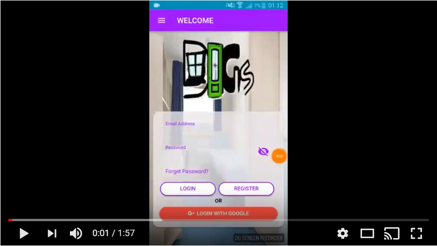](https://youtu.be/-_PzyPdflOI)

## More in depth video
[](https://youtu.be/OjgK4KCnwSo)


[Top](#contents) 

# Dissertation<a name = "dissertation"></a>
Click below to view our Dissertation PDF or click [here](https://github.com/gerardnaughton7/4th-Year-Final-Year-Project/tree/master/DigsDissertation) to view the latex files used to create it. 

<kbd>[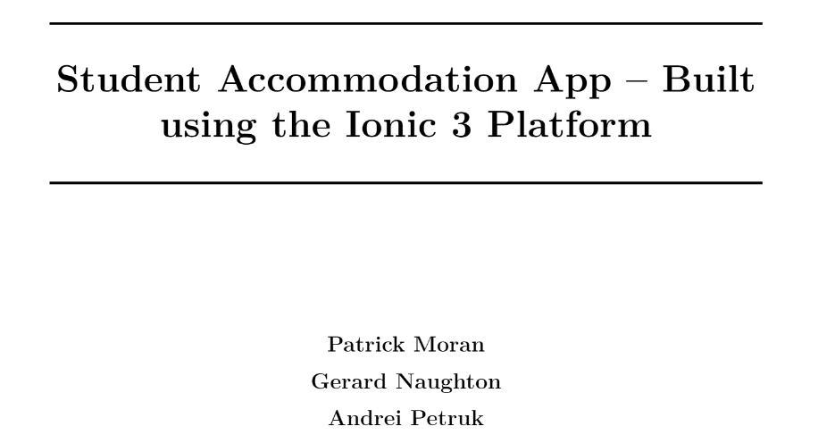</img>](https://github.com/gerardnaughton7/4th-Year-Final-Year-Project/blob/master/DigsDissertation.pdf)</kbd>


[Top](#contents) 

# Project Wiki<a name = "wiki"></a>
Click [here](https://github.com/gerardnaughton7/4th-Year-Final-Year-Project/wiki) to view our Project Wiki.

[Top](#contents) 

# Architecture<a name = "arc"></a>
The following is an overview of the Technologies/Architecture used creating Digs.   

<p align="center"><kbd></p></kbd>

### Presentation Tier

* [Ionic 3 Framework](https://ionicframework.com/docs/)
* [Angular 4 Framework](https://angular.io/)
* [Firebase Authentication](https://firebase.google.com/)

### Logic Tier
* [NodeJS](https://nodejs.org/en/)

### Data Tier
* [MongoDB](https://www.mongodb.com/company) Database 

[Top](#contents) 

# Features<a name = "features"></a>
The following are the main features of our project:
* Users can view our accommodation lists
* Users can search our accommodation lists
* Users can view our Digs Message Board
* Users can create their own Account
* Users can Log into their Account
* Users can reset their password if they have forgotten theirs
* Logged in users can create their own accommodation ads for the app
* Logged in users can post their own messages on the Digs Message Board
* Logged in users can view ads they have created
* Logged in users can edit and delete ads they have created

[Top](#contents) 

# App Preview<a name = "preview"></a>
The following images are previews of various pages in our application.  

* Login Page

| Android  | iOS |
| :-------------: | :-------------: |
| 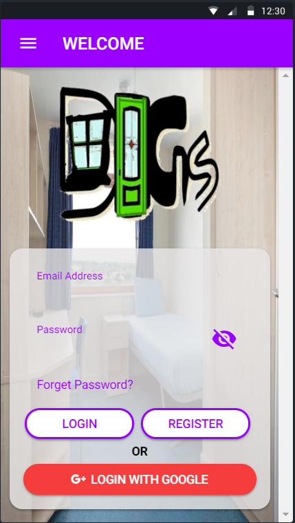  | 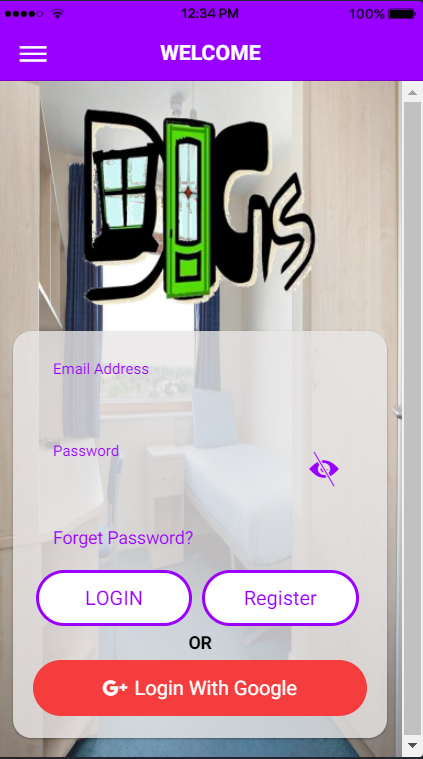  |

[Top](#contents) 

* Home Page

| Android  | iOS |
| :-------------: | :-------------: |
| 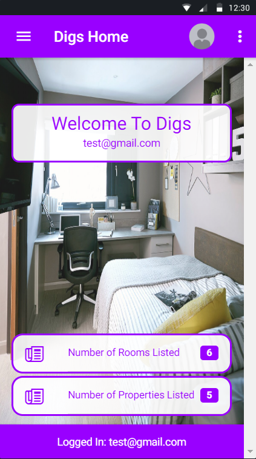  | 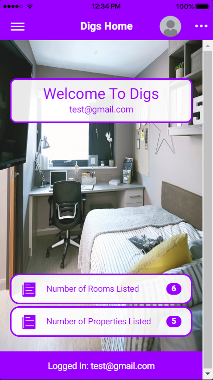  |

[Top](#contents) 

* Room/Property Listings

| Android  | iOS |
| :-------------: | :-------------: |
| 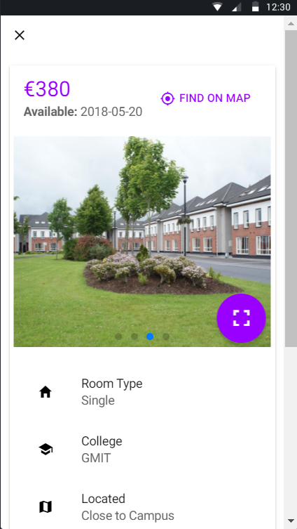  | 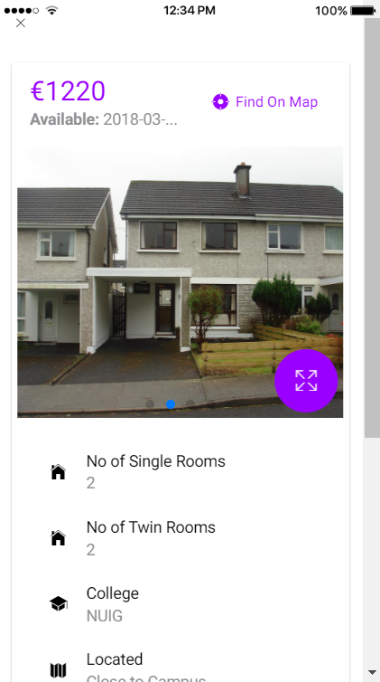  |

[Top](#contents) 

* Create Ad

| Android  | iOS |
| :-------------: | :-------------: |
| 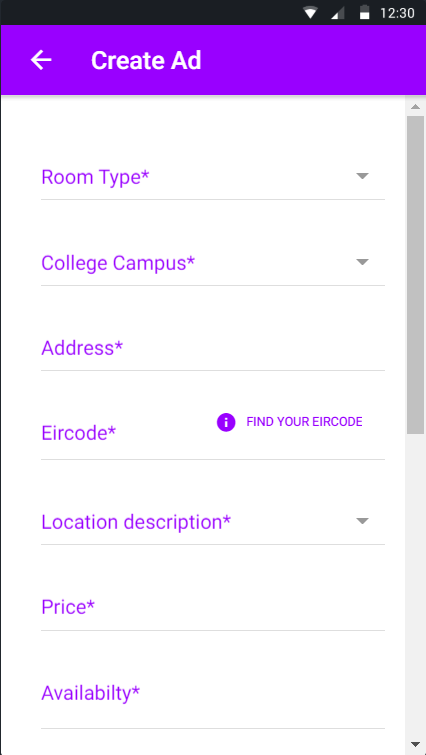  | 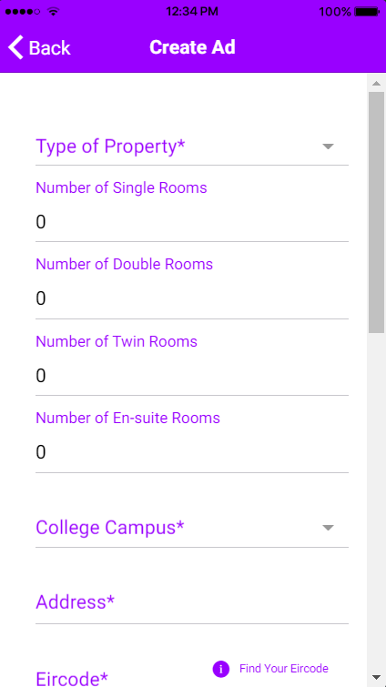  |


[Top](#contents)

* Search

| Android  | iOS |
| :-------------: | :-------------: |
| 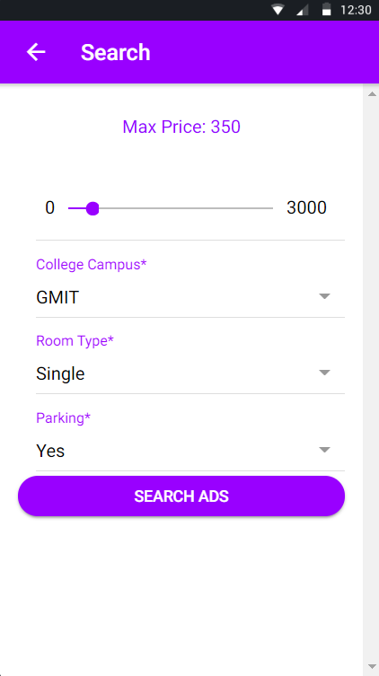  | 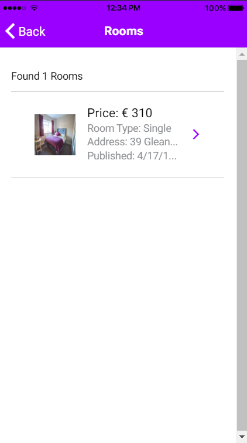  |


[Top](#contents)

* Message Board

| Android  | iOS |
| :-------------: | :-------------: |
| 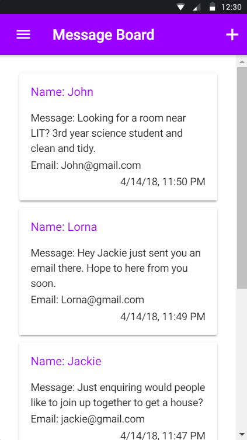  | 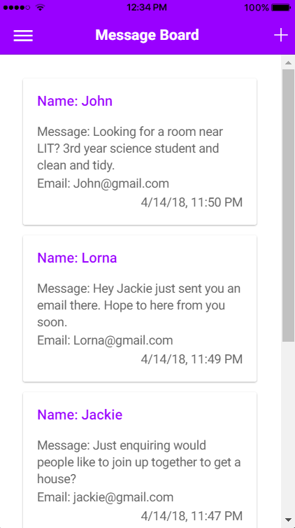  |


[Top](#contents)

# Deployment<a name = "deploy"></a>
### Deploy on Android Device
* This repository contains our [Digs.apk]() file
* Download this apk and install it on your android device.

## Deploy Locally


Prerequisites
* Mongo Installed - Click [here](https://www.mongodb.com/download-center?jmp=tutorials&_ga=2.180285351.2088142531.1523826631-1629278295.1507240892#community) for instructions.
* NodeJS, Ionic, Cordova - Click [here](https://ionicframework.com/docs/intro/installation/) and follow the instructions.

### Deploy Back-End
1. Clone or Download this repository.
2. Start mongo running by executing the following command from the bin folder of your installation of Mongo.  
```bash
mongod
```
3. On your terminal navigate to the Digs Back-end folder. Make sure that mongo is running.  
3.1 Navigate into DigsImageServer and run these commands:
```bash
npm install
npm start
```

&nbsp;&nbsp;&nbsp;3.2 Then navigate back into DigsServer and repeat the same commands in there:

```bash
npm install
npm start
```

Now the back-end is running locally in your machine.

### Deploy Front End
1. Clone or Download this repository.
2. In your terminal navigate into the Digs folder.
3. Currently the application is configured to work our back-end running on an Amazon Web Instance. If you would like to run this application with the back-end running locally on your machine you need to make the following changes:  
* You need to change the apiURL link in the following files:
    * images.ts line num: 9 to apiURL = 'http://localhost:3000/';
    * messages.ts line num: 10 to apiURL = 'http://localhost:3000/';
    * propertyAds.ts line num: 9 to apiURL = 'http://localhost:3000/';
    * roomAds.ts line num: 12 to apiURL = 'http://localhost:3000/';
  
4. Run the following command to install the project dependencies.

```bash
npm install
```
5. Once complete run this command to view the application running in development mode.

```bash
ionic serve --lab
```

[Top](#contents) 
